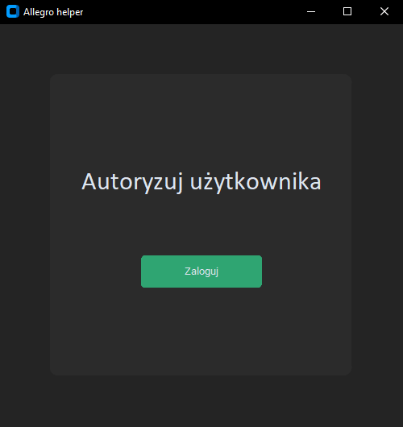
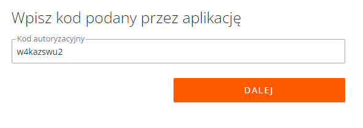
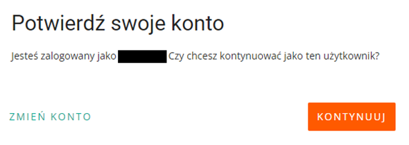
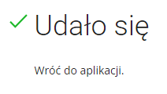
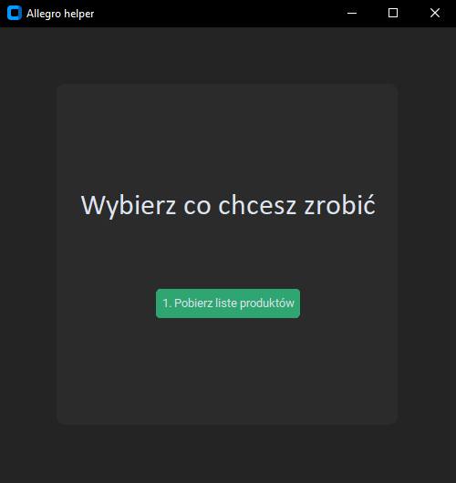
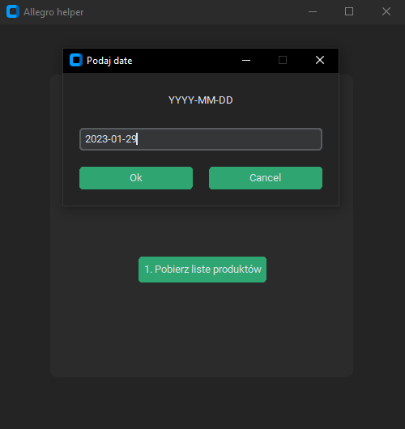
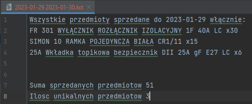

<h1 align="center">Allegro helper - Python</h1>
<h2 align="center">PL</h2>
## Table of Contents

- [Opis](#Opis)
  - [Demo](#demo)
- [Kontakt](#kontakt) 

## Opis

Jest to projekt w którym chciałem pomóc tacie, przy prowadzeniu sklepu internetowego. 
Ta aplikacja aktualnie ma 1 opcję, ale jest dla nas bardzo ważna, ponieważ będziemy mogli zoptymalizować i sprawdzać, co i w jakiej ilości zostało sprzedane, ułatwi nam to bardzo życię, zwłaszcza gdy trzeba będzie uzupełnić półki/zatowarować się.

## Demo
### Etapy
1. Autoryzacja użytkownika
   - Automatycznie otwiera przeglądarkę i przekierowuje na stronę do autoryzacji. Wszystko co trzeba robić to klikać przycisk dalej/akceptuj. 
   -  
   -  Kiedy wejdziesz na strone automatycznie wygenerowany kod będzie wpisany.  
   -  
   -  

2. Jeśli wszystko pójdzie dobrze, to zobaczysz część odpowiedzialną za funkcjonowanie aplikacji.
   - Przez najbliższe 12 godzin użytkownik, nie będzie musiał się autoryzować ponieważ klucz jest aktywny przez 12 godzin i jest on zapisywany do pliku, aby nie tworzyć niepotrzebnych requestów.
   - Teraz zobaczysz menu. 
   -  
   - Przykładowy wynik opcji 1 

## Kontakt

- GitHub [@xxFroggyxx](https://github.com/xxFroggyxx/)

<h2 align="center">ENG</h2>

## Table of Contents

- [Overview](#overview)
  - [Demo](#demo)
- [Contact](#contact) 

## Overview

This is my Python project that I wanted to help my dad with our ecommerce shop. 
This application currently has 1 option, but it is very important to us because we will be able to optimize and check what has been sold and in what quantity, and this makes life much easier, especially when you have to order products later.

## Demo
### Steps
1. User authorization
    - Automatically opens browser and redirects to authorization website. All u need to do is clicking continue/accept buttons. 
   -  
   - After entering, you have already entered the automatically generated authorization code.  
   -  
   -  

2. If everything goes right, u will see Functional part
   - And now for the next 12 hours you will not have to authorize yourself because the key is active(12 hours) and saved to a file.
   - Now u see menu and options. 
   -  
   - Example result of option 1 

## Contact

- GitHub [@xxFroggyxx](https://github.com/xxFroggyxx/)

