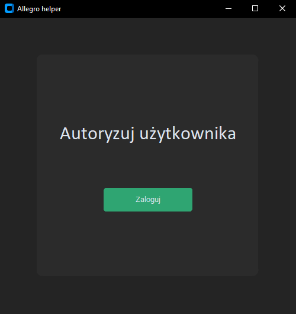
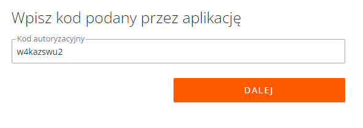
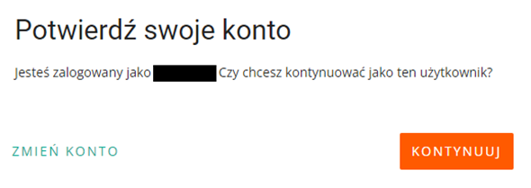
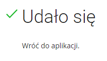
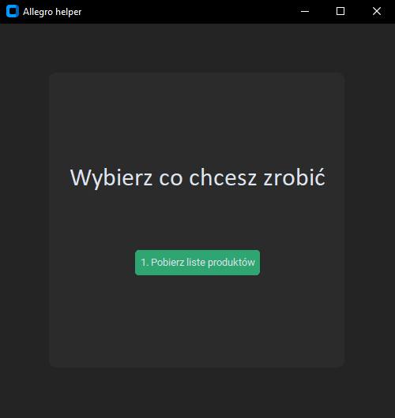
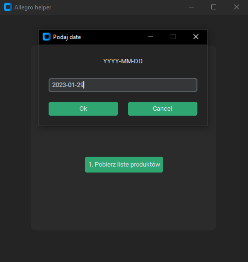
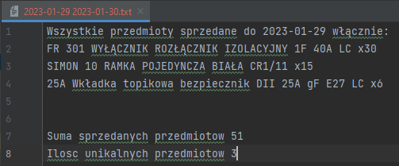

# Overview

This is my Python project that I wanted to help my dad with our ecommerce shop. 
This application currently has 1 option, but it is very important to us because we will be able to optimize and check what has been sold and in what quantity, and this makes life much easier, especially when you have to order products later.

## User authorization
- Automatically opens browser and redirects to authorization website. All u need to do is clicking continue/accept buttons.

- After entering, you have already entered the automatically generated authorization code.

## Functional part

If everything goes right, u will see Functional part

- And now for the next 12 hours you will not have to authorize yourself because the key is active (12 hours) and saved to a file.
- Now u see menu and options.

| Main Screen  | Date Picker |
| ------------- | ------------- |
|   |   |

- Example result of the operation

## Contact

- GitHub [@xxFroggyxx](https://github.com/xxFroggyxx/)
- Linkedin [Wojciech Klimczewski](https://www.linkedin.com/in/wojciech-klimczewski/)