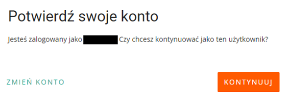

## Opis

Jest to projekt w którym chciałem pomóc tacie, przy prowadzeniu sklepu internetowego. 
Ta aplikacja aktualnie ma 1 opcję, ale jest dla nas bardzo ważna, ponieważ będziemy mogli zoptymalizować i sprawdzać, co i w jakiej ilości zostało sprzedane, ułatwi nam to bardzo życię, zwłaszcza gdy trzeba będzie uzupełnić półki/zatowarować się.

## Autoryzacja użytkownika
- Automatycznie otwiera przeglądarkę i przekierowuje na stronę do autoryzacji. Wszystko co trzeba robić to klikać przycisk dalej/akceptuj. 

-  Kiedy wejdziesz na strone automatycznie wygenerowany kod będzie wpisany.
 

## Część główna programu

Jeśli wszystko pójdzie dobrze, to zobaczysz część odpowiedzialną za funkcjonowanie aplikacji.

- Przez najbliższe 12 godzin użytkownik, nie będzie musiał się autoryzować ponieważ klucz jest aktywny przez 12 godzin i jest on zapisywany do pliku, aby nie tworzyć niepotrzebnych requestów.
- Teraz zobaczysz menu.

| Główny Ekran             | Operacja 1 / Wybieranie daty        |
|--------------------------|-------------------------------------|
|  |  |

- Example result of the operation

## Kontakt

- GitHub [@xxFroggyxx](https://github.com/xxFroggyxx/)
- Linkedin [Wojciech Klimczewski](https://www.linkedin.com/in/wojciech-klimczewski/)